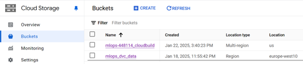
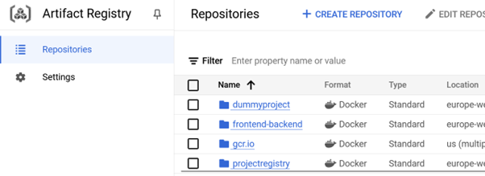
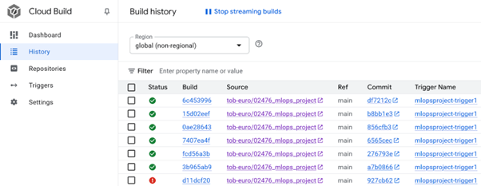
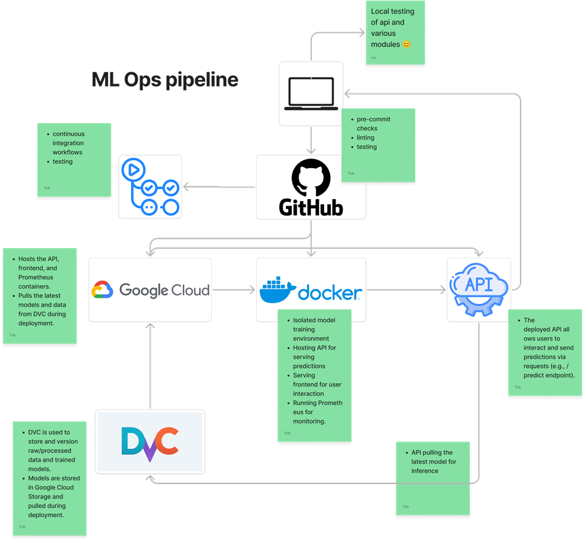

# Exam template for 02476 Machine Learning Operations

This is the report template for the exam. Please only remove the text formatted as with three dashes in front and behind
like:

```--- question 1 fill here ---```

Where you instead should add your answers. Any other changes may have unwanted consequences when your report is
auto-generated at the end of the course. For questions where you are asked to include images, start by adding the image
to the `figures` subfolder (please only use `.png`, `.jpg` or `.jpeg`) and then add the following code in your answer:

```markdown

```

In addition to this markdown file, we also provide the `report.py` script that provides two utility functions:

Running:

```bash
python report.py html
```

Will generate a `.html` page of your report. After the deadline for answering this template, we will auto-scrape
everything in this `reports` folder and then use this utility to generate a `.html` page that will be your serve
as your final hand-in.

Running

```bash
python report.py check
```

Will check your answers in this template against the constraints listed for each question e.g. is your answer too
short, too long, or have you included an image when asked. For both functions to work you mustn't rename anything.
The script has two dependencies that can be installed with

```bash
pip install typer markdown
```

## Overall project checklist

The checklist is *exhaustive* which means that it includes everything that you could do on the project included in the
curriculum in this course. Therefore, we do not expect at all that you have checked all boxes at the end of the project.
The parenthesis at the end indicates what module the bullet point is related to. Please be honest in your answers, we
will check the repositories and the code to verify your answers.

**Week 1**
- [x] Week 1  Create a git repository (M5)
- [x] Make sure that all team members have write access to the GitHub repository (M5)
- [x] Create a dedicated environment for you project to keep track of your packages (M2)
- [x] Create the initial file structure using cookiecutter with an appropriate template (M6)
- [x] Fill out the data.py file such that it downloads whatever data you need and preprocesses it (if necessary) (M6)
- [x] Add a model to model.py and a training procedure to train.py and get that running (M6)
- [x] Remember to fill out the requirements.txt and requirements_dev.txt file with whatever dependencies that you are using (M2+M6)
- [x] Remember to comply with good coding practices (pep8) while doing the project (M7)
- [x] Do a bit of code typing and remember to document essential parts of your code (M7)
- [x] Setup version control for your data or part of your data (M8)
- [ ] Add command line interfaces and project commands to your code where it makes sense (M9)
- [x] Construct one or multiple docker files for your code (M10)
- [x] Build the docker files locally and make sure they work as intended (M10)
- [x] Write one or multiple configurations files for your experiments (M11)
- [ ] Used Hydra to load the configurations and manage your hyperparameters (M11)
- [ ] Use profiling to optimize your code (M12)
- [x] Use logging to log important events in your code (M14)
- [ ] Use Weights & Biases to log training progress and other important metrics/artifacts in your code (M14)
- [ ] Consider running a hyperparameter optimization sweep (M14)
- [ ] Use PyTorch-lightning (if applicable) to reduce the amount of boilerplate in your code (M15)


**Week 2**
- [x] Write unit tests related to the data part of your code (M16)
- [x] Write unit tests related to model construction and or model training (M16)
- [x] Calculate the code coverage (M16)
- [x] Get some continuous integration running on the GitHub repository (M17)
- [x] Add caching and multi-os/python/pytorch testing to your continuous integration (M17)
- [x] Add a linting step to your continuous integration (M17) Add pre-commit hooks to your version control setup (M18)
- [ ] Add a continues workflow that triggers when data changes (M19)
- [ ] Add a continues workflow that triggers when changes to the model registry is made (M19)
- [x] Create a data storage in GCP Bucket for your data and link this with your data version control setup (M21)
- [x] Create a trigger workflow for automatically building your docker images (M21)
- [ ] Get your model training in GCP using either the Engine or Vertex AI (M21)
- [x] Create a FastAPI application that can do inference using your model (M22)
- [ ] Deploy your model in GCP using either Functions or Run as the backend (M23)
- [ ] Write API tests for your application and setup continues integration for these (M24)
- [ ] Load test your application (M24)
- [ ] Create a more specialized ML-deployment API using either ONNX or BentoML, or both (M25)
- [x] Create a frontend for your API (M26)


**Week 3**
- [ ] Check how robust your model is towards data drifting (M27)
- [ ] Deploy to the cloud a drift detection API (M27)
- [x] Instrument your API with a couple of system metrics (M28)
- [ ] Setup cloud monitoring of your instrumented application (M28)
- [x] Create one or more alert systems in GCP to alert you if your app is not behaving correctly (M28)
- [ ] If applicable, optimize the performance of your data loading using distributed data loading (M29)
- [ ] If applicable, optimize the performance of your training pipeline by using distributed training (M30)
- [x] Play around with quantization, compilation and pruning for you trained models to increase inference speed (M31)


**Extra**
- [ ] Write some documentation for your application (M32)
- [ ] Publish the documentation to GitHub Pages (M32)
- [ ] Revisit your initial project description. Did the project turn out as you wanted?
- [x] Create an architectural diagram over your MLOps pipeline
- [x] Make sure all group members have an understanding about all parts of the project
- [x] Uploaded all your code to GitHub

## Group information

### Question 1
> **Enter the group number you signed up on <learn.inside.dtu.dk>**
>
> Answer:

58

### Question 2
> **Enter the study number for each member in the group**
>
> Example:
>
> *sXXXXXX, sXXXXXX, sXXXXXX*
>
> Answer:

s234823, s234830, s234865

### Question 3
> **A requirement to the project is that you include a third-party package not covered in the course. What framework**
> **did you choose to work with and did it help you complete the project?**
>
> Recommended answer length: 100-200 words.
>
> Example:
> *We used the third-party framework ... in our project. We used functionality ... and functionality ... from the*
> *package to do ... and ... in our project*.
>
> Answer:

For our project, we used the Transformers framework by Huggingface. This library provides access to numerous pretrained models, making it an excellent choice for our text classification task. We specifically used the cardiffnlp/twitter-roberta-base model, which is well-suited for social media text analysis.
The Transformers framework allowed us to load and fine-tune this model for our binary classification problem (disaster vs. non-disaster tweets). Its seamless integration with PyTorch simplified tasks like model loading, tokenization, and inference. Additionally, we benefited from the flexibility to load pretrained weights from Huggingface's repository, as training everything ourselves would not have been feasible.


## Coding environment

> In the following section we are interested in learning more about you local development environment. This includes
> how you managed dependencies, the structure of your code and how you managed code quality.

### Question 4

> **Explain how you managed dependencies in your project? Explain the process a new team member would have to go**
> **through to get an exact copy of your environment.**
>
> Recommended answer length: 100-200 words
>
> Example:
> *We used ... for managing our dependencies. The list of dependencies was auto-generated using ... . To get a*
> *complete copy of our development environment, one would have to run the following commands*
>
> Answer:

We used conda for managing our dependencies and environments in the project. Each team member maintained their own separate conda environment but ensured consistency by relying on the requirements.txt and requirements_dev.txt files provided in the project.
To set up the environment, a team member would:
Clone the project repository from version control (e.g., GitHub).
Install conda (if not already installed).
Create and activate their own conda environment using:
conda create --name <env_name> python=3.11
conda activate <env_name>
Install the project dependencies by running:
pip install -r requirements.txt
pip install -r requirements_dev.txt


### Question 5

> **We expect that you initialized your project using the cookiecutter template. Explain the overall structure of your**
> **code. What did you fill out? Did you deviate from the template in some way?**
>
> Recommended answer length: 100-200 words
>
> Example:
> *From the cookiecutter template we have filled out the ... , ... and ... folder. We have removed the ... folder*
> *because we did not use any ... in our project. We have added an ... folder that contains ... for running our*
> *experiments.*
>
> Answer:

From the cookiecutter template we have filled out the configs, .github, data, dockerfiles, models, src, tests and reports folder. We have removed the notebooks and the docs folder because we did not use any notebooks or generate documentation with MkDocs for our project. We also added an .dvc folder to manage experiment configuration and track data versions using Data Version Control (DVC). Inside the src folder, we’ve broken the code into separate modules for handling data, training models, evaluating them, and running inference, which helps keep everything organized. The api.py  file runs the FastAPI server, while train.py takes care of training the model. We’ve created unit tests in the folder tests to cover data processing, API and model behavior to ensure everything works correctly. 


### Question 6

> **Did you implement any rules for code quality and format? What about typing and documentation? Additionally,**
> **explain with your own words why these concepts matters in larger projects.**
>
> Recommended answer length: 100-200 words.
>
> Example:
> *We used ... for linting and ... for formatting. We also used ... for typing and ... for documentation. These*
> *concepts are important in larger projects because ... . For example, typing ...*
>
> Answer:

We used Ruff with pre-commit hooks for linting and formatting, which helped keep our code clean and consistent. Ruff automatically fixed issues, enforced a line length of 120 characters, and pre-commit hooks handled YAML standards, trailing whitespace, and proper file endings.
We added Python’s built-in type hints to define function inputs and outputs, making the code easier to read, debug, and work on collaboratively. For documentation, we wrote clear docstrings for functions and classes to explain their purpose and usage.
These practices were crucial for maintaining readability and keeping everything organized, especially in a team setting. Automated checks with pre-commit saved us time and ensured everyone’s contributions met the same quality standards. Good documentation means that anyone new to the project can quickly get up to speed without needing constant explanations. And by enforcing rules around formatting and linting, we ensure the code stays clean and readable.


## Version control

> In the following section we are interested in how version control was used in your project during development to
> corporate and increase the quality of your code.

### Question 7

> **How many tests did you implement and what are they testing in your code?**
>
> Recommended answer length: 50-100 words.
>
> Example:
> *In total we have implemented X tests. Primarily we are testing ... and ... as these the most critical parts of our*
> *application but also ... .*
>
> Answer:

In total, we have implemented eight main tests. These include tests for data handling, such as loading datasets, preprocessing single text samples, processing the entire dataset, and ensuring all labels are represented correctly. We also test model functionality, including building the model and initializing it without pre-trained weights. Additionally, we have API endpoint tests to verify the /, /health, and /metrics endpoints are working as expected. These tests cover the stability of our data processing pipeline, model construction, and API functionality, which are all critical for ensuring the reliability of the application.


### Question 8

> **What is the total code coverage (in percentage) of your code? If your code had a code coverage of 100% (or close**
> **to), would you still trust it to be error free? Explain you reasoning.**
>
> Recommended answer length: 100-200 words.
>
> Example:
> *The total code coverage of code is X%, which includes all our source code. We are far from 100% coverage of our **
> *code and even if we were then...*
>
> Answer:

The total code coverage of our project is 36%. This is relatively low, mainly because some important files like evaluate.py, frontend.py, and train.py have no tests at all, and others like api.py (55%) and data.py (69%) are only partially covered.
The low coverage is mainly due to the lack of tests for key parts of the application, such as the evaluation logic, model training, and frontend functionality. These areas haven't been fully tested yet.
Even if we had 100% coverage, we wouldn't necessarily trust the code to be error-free. Coverage only tells us which lines of code are being executed in tests, but it doesn't guarantee that the code is working correctly or handling edge cases. Tests also need to make sure the logic is right and cover a variety of scenarios.


### Question 9

> **Did you workflow include using branches and pull requests? If yes, explain how. If not, explain how branches and**
> **pull request can help improve version control.**
>
> Recommended answer length: 100-200 words.
>
> Example:
> *We made use of both branches and PRs in our project. In our group, each member had an branch that they worked on in*
> *addition to the main branch. To merge code we ...*
>
> Answer:

We didn’t strictly use separate branches for each member, instead, we often pushed changes directly to the main branch after making updates. Since this was one of our first experiences collaborating on a larger project with GitHub, we kept things simple and focused on getting comfortable with version control.
As the project progressed, we learned more about Git workflows and how branching and pull requests can help manage changes, avoid conflicts, and maintain a cleaner project history. It was a valuable learning process, and we feel more confident about using these practices in future projects to improve collaboration and ensure smoother teamwork.


### Question 10

> **Did you use DVC for managing data in your project? If yes, then how did it improve your project to have version**
> **control of your data. If no, explain a case where it would be beneficial to have version control of your data.**
>
> Recommended answer length: 100-200 words.
>
> Example:
> *We did make use of DVC in the following way: ... . In the end it helped us in ... for controlling ... part of our*
> *pipeline*
>
> Answer:

We did make use of DVC in the following way: we set up remote storage on Google Cloud Storage and used DVC to track and version our dataset. Instead of keeping large files in Git, DVC allowed us to store just the metadata in Git and manage the actual data separately.
In the end, it helped us in ensuring reproducibility and collaboration. By linking each version of our dataset to specific versions of the code, we could easily track changes and ensure everyone was working with the same data version. This streamlined our pipeline and made it much easier to manage updates and experiments.


### Question 11

> **Discuss you continuous integration setup. What kind of continuous integration are you running (unittesting,**
> **linting, etc.)? Do you test multiple operating systems, Python  version etc. Do you make use of caching? Feel free**
> **to insert a link to one of your GitHub actions workflow.**
>
> Recommended answer length: 200-300 words.
>
> Example:
> *We have organized our continuous integration into 3 separate files: one for doing ..., one for running ... testing*
> *and one for running ... . In particular for our ..., we used ... .An example of a triggered workflow can be seen*
> *here: <weblink>*
>
> Answer:

We have organized our continuous integration into two main workflows: one for managing the data pipeline and another for running unit tests. These workflows are powered by GitHub Actions, which allow us to automate the testing and deployment processes effectively.
For unit testing, we use a matrix strategy within GitHub Actions to ensure our code works across multiple operating systems (Ubuntu, Windows, macOS) and Python versions (3.11 and 3.12). This cross-platform testing guarantees that our codebase is compatible with a variety of environments, which is especially important in machine learning projects that may need to run on different platforms. Each time a push or pull request is made to the main branch, the tests are automatically triggered.
The first steps in the workflow involve checking out the code and setting up the appropriate Python version based on the matrix configuration. We then install the required dependencies, including testing tools like pytest, to execute the tests. The tests are run on all specified platforms and Python versions, and the results are displayed directly in the GitHub Actions logs.
Additionally, we leverage caching for Python dependencies to speed up the build process. This caching ensures that packages that have been previously installed are not reinstalled in subsequent runs, reducing the overall time spent on each test run.
An example of a triggered workflow can be seen here: https://github.com/tob-euro/02476_mlops_project/actions/runs/12917746506

## Running code and tracking experiments

> In the following section we are interested in learning more about the experimental setup for running your code and
> especially the reproducibility of your experiments.

### Question 12

> **How did you configure experiments? Did you make use of config files? Explain with coding examples of how you would**
> **run a experiment.**
>
> Recommended answer length: 50-100 words.
>
> Example:
> *We used a simple argparser, that worked in the following way: Python  my_script.py --lr 1e-3 --batch_size 25*
>
> Answer:

We configured experiments using configuration files where we define the model parameters, training settings, paths, and other necessary configurations. For example, the model settings are defined under the model section, while training parameters such as the number of epochs, batch size, and learning rate are set under the training section.
We used a simple Python script to run the experiment, where we load the configuration using a load_config() function. For training, we load the dataset, model, and optimizer settings from the config file, and then train the model using the specified parameters.


### Question 13

> **Reproducibility of experiments are important. Related to the last question, how did you secure that no information**
> **is lost when running experiments and that your experiments are reproducible?**
>
> Recommended answer length: 100-200 words.
>
> Example:
> *We made use of config files. Whenever an experiment is run the following happens: ... . To reproduce an experiment*
> *one would have to do ...*
>
> Answer:

To make sure our experiments are reproducible and no information is lost, we implemented detailed logging and used version control. Every time an experiment runs, we log key details like the hyperparameters (e.g., epochs, batch size, learning rate), training progress, and model performance. These logs are saved in a structured way, so they can be easily referred back to.
We also use Git for version control, which means anyone can access the exact same code to run the experiment again. During training, we save model checkpoints, so if needed, we can resume or verify the experiment at any point.
To reproduce an experiment, you would simply clone the repository, set up the environment using requirements.txt, and run the training script with the same parameters. 


### Question 14

> **Upload 1 to 3 screenshots that show the experiments that you have done in W&B (or another experiment tracking**
> **service of your choice). This may include loss graphs, logged images, hyperparameter sweeps etc. You can take**
> **inspiration from [this figure](figures/wandb.png). Explain what metrics you are tracking and why they are**
> **important.**
>
> Recommended answer length: 200-300 words + 1 to 3 screenshots.
>
> Example:
> *As seen in the first image when have tracked ... and ... which both inform us about ... in our experiments.*
> *As seen in the second image we are also tracking ... and ...*
>
> Answer:

We didn’t use W&B or any other experiment tracking service because we don’t have the correct answers for the test set. Since the only way to test our models is by submitting them to Kaggle for evaluation, we couldn’t track metrics like accuracy or loss on a separate validation set. This made it challenging to track performance independently of Kaggle’s validation process, as the results are provided only after submission to the competition platform. Therefore, we relied on Kaggle's system for validation and testing rather than setting up an additional tracking service.


### Question 15

> **Docker is an important tool for creating containerized applications. Explain how you used docker in your**
> **experiments/project? Include how you would run your docker images and include a link to one of your docker files.**
>
> Recommended answer length: 100-200 words.
>
> Example:
> *For our project we developed several images: one for training, inference and deployment. For example to run the*
> *training docker image: `docker run trainer:latest lr=1e-3 batch_size=64`. Link to docker file: <weblink>*
>
> Answer:

For our project, we created multiple Docker images for different components, such as training, inference, and deployment. Each component runs in a containerized environment to ensure consistency across different systems.
For example, to run the training process inside a Docker container, we use the following command:
docker run train:latest --epochs 3 --batch_size 16 --learning_rate 0.00001
This command runs the training script with specified parameters. The Docker image contains all the necessary dependencies, such as Python, libraries, and project files, ensuring the experiment can be reproduced in any environment.
We also created Docker images for the API server (FastAPI), frontend (Streamlit), and Prometheus monitoring. Each image has a dedicated Dockerfile with environment-specific setup and configuration. Below is a link to one of the Dockerfiles used for training:
https://github.com/tob-euro/02476_mlops_project/blob/main/dockerfiles/train.dockerfile
This approach allows us to efficiently manage and deploy the entire experiment pipeline in isolated, reproducible environments.


### Question 16

> **When running into bugs while trying to run your experiments, how did you perform debugging? Additionally, did you**
> **try to profile your code or do you think it is already perfect?**
>
> Recommended answer length: 100-200 words.
>
> Example:
> *Debugging method was dependent on group member. Some just used ... and others used ... . We did a single profiling*
> *run of our main code at some point that showed ...*
>
> Answer:

When we ran into bugs while running our experiments, we mostly used print statements to track variables and outputs during execution. This helped us quickly spot where things were going wrong. We also used GitHub Copilot for extra support, which suggested potential fixes and helped with debugging. For more tricky problems, we turned to Google and Stack Overflow, where we found solutions or similar issues discussed by others, which helped us get past roadblocks. While we didn’t do any formal profiling, we kept an eye on the code’s performance and made improvements when needed. Overall, a mix of these methods helped us ensure our experiments ran smoothly and our code worked as expected.

## Working in the cloud

> In the following section we would like to know more about your experience when developing in the cloud.

### Question 17

> **List all the GCP services that you made use of in your project and shortly explain what each service does?**
>
> Recommended answer length: 50-200 words.
>
> Example:
> *We used the following two services: Engine and Bucket. Engine is used for... and Bucket is used for...*
>
> Answer:

We used the following services: Cloud Storage, Compute Engine, Vertex AI, Artifact Registry and Cloud Build.
Cloud Storage buckets were used to store DVC data and build artifacts. Compute Engine provided VMs for training models using custom Docker images - we also used Vertex AI for managed training jobs - while we made progress integrating our Docker images (stored in Artifact Registry) into Vertex AI for training, we were unable to get model training fully operational in the cloud. Cloud Build managed deploying updated Docker images to the Artifact Registry whenever code changes occurred.


### Question 18

> **The backbone of GCP is the Compute engine. Explained how you made use of this service and what type of VMs**
> **you used?**
>
> Recommended answer length: 100-200 words.
>
> Example:
> *We used the compute engine to run our ... . We used instances with the following hardware: ... and we started the*
> *using a custom container: ...*
>
> Answer:

We attempted to use Compute Engine for training our model online. We set up two instances: one with 1 CPU core and 4 GB of RAM and another with 2 CPU cores and 4 GB of RAM. Using the SSH-in-browser tool to interact with the VMs, we cloned the project’s GitHub repository and installed the required dependencies. However, we encountered issues when trying to run the Python scripts for data processing and training, as they failed to execute successfully. Part of the problem stemmed from the package installation not running as expected, which prevented the proper setup of our package. Additionally, we installed Docker and attempted to run a pre-built training image from the cloud, but we faced similar issues, leaving the training process unresolved.


### Question 19

> **Insert 1-2 images of your GCP bucket, such that we can see what data you have stored in it.**
> **You can take inspiration from [this figure](figures/bucket.png).**
>
> Answer:

```markdown

```

### Question 20

> **Upload 1-2 images of your GCP artifact registry, such that we can see the different docker images that you have**
> **stored. You can take inspiration from [this figure](figures/registry.png).**
>
> Answer:

```markdown

```

### Question 21

> **Upload 1-2 images of your GCP cloud build history, so we can see the history of the images that have been build in**
> **your project. You can take inspiration from [this figure](figures/build.png).**
>
> Answer:

```markdown

```

### Question 22

> **Did you manage to train your model in the cloud using either the Engine or Vertex AI? If yes, explain how you did**
> **it. If not, describe why.**
>
> Recommended answer length: 100-200 words.
>
> Example:
> *We managed to train our model in the cloud using the Engine. We did this by ... . The reason we choose the Engine*
> *was because ...*
>
> Answer:

Our initial plan was to train the model in a Compute Engine VM. We created a VM with 1 CPU core and 4 GB RAM, cloned the GITHub repository and installed pip packages. We ran into some SSL issues during data download. After having rebuilt python with SSL in the VM a few times without luck, we gave up on Compute Engine for model training.
For Vertex, we were able to submit a custom job using a docker-image built in the cloud. Unfortunately, we ran into issues also during data download, that we ultimately left unresolved.


## Deployment

### Question 23

> **Did you manage to write an API for your model? If yes, explain how you did it and if you did anything special. If**
> **not, explain how you would do it.**
>
> Recommended answer length: 100-200 words.
>
> Example:
> *We did manage to write an API for our model. We used FastAPI to do this. We did this by ... . We also added ...*
> *to the API to make it more ...*
>
> Answer:

We did manage to write an API for our model. We used FastAPI to implement the API, which allowed us to define endpoints for predicting disaster-related tweets. To achieve this, we loaded our pre-trained BERT model using Hugging Face's Transformers library and set up a /predict endpoint that accepts input text, processes it using the model, and returns the predicted label and confidence score. Additionally, we instrumented the API with Prometheus metrics for monitoring. These metrics include counters for request counts and errors, histograms for latency tracking, and summaries of input text lengths.
For cloud deployment, we containerized the API using Docker and deployed it on Google Cloud Run. We configured it with a sidecar Prometheus container for collecting and exposing metrics to GCP Monitoring. This setup ensured scalability, observability, and robustness in production.


### Question 24

> **Did you manage to deploy your API, either in locally or cloud? If not, describe why. If yes, describe how and**
> **preferably how you invoke your deployed service?**
>
> Recommended answer length: 100-200 words.
>
> Example:
> *For deployment we wrapped our model into application using ... . We first tried locally serving the model, which*
> *worked. Afterwards we deployed it in the cloud, using ... . To invoke the service an user would call*
> *`curl -X POST -F "file=@file.json"<weburl>`*
>
> Answer:

We successfully deployed our API both locally and in the cloud. For deployment, we wrapped our model in a FastAPI application and containerized it using Docker. Locally, we served the API using Uvicorn, exposing it at http://127.0.0.1:8080, which allowed us to test the endpoints and functionality.
For cloud deployment, we used Google Cloud Run. We built and pushed the Docker image to Google Container Registry (GCR) and deployed it to Cloud Run. We configured the service with 1 GiB memory, a custom environment variable for credentials, and a timeout of 600 seconds. The API is accessible via a public endpoint provided by Cloud Run, listed in the readme.md of the project.
To invoke the service, users can send a POST request to the /predict endpoint with the required text input. For example:
curl -X POST https://twitter-backend-<id>.<region>.run.app/predict \
     -H "Content-Type: application/json" \
     -d '{"text": "Sample tweet text"}'


### Question 25

> **Did you perform any unit testing and load testing of your API? If yes, explain how you did it and what results for**
> **the load testing did you get. If not, explain how you would do it.**
>
> Recommended answer length: 100-200 words.
>
> Example:
> *For unit testing we used ... and for load testing we used ... . The results of the load testing showed that ...*
> *before the service crashed.*
>
> Answer:

For unit testing, we used pytest to validate the functionality of the API endpoints, focusing on the /, /health, and /predict endpoints. While we successfully tested the basic endpoints (/ and /health), testing the /predict endpoint presented challenges. Specifically in mocking external dependencies like the tokenizer and model using unittest.mock.
We did not perform any load testing, however this could be done using for example the locust library.


### Question 26

> **Did you manage to implement monitoring of your deployed model? If yes, explain how it works. If not, explain how**
> **monitoring would help the longevity of your application.**
>
> Recommended answer length: 100-200 words.
>
> Example:
> *We did not manage to implement monitoring. We would like to have monitoring implemented such that over time we could*
> *measure ... and ... that would inform us about this ... behaviour of our application.*
>
> Answer:

We managed to implement monitoring locally without any issues, using the procedure described in the course. Here we tracked key metrics such as request counts, response times, error rates, and text input lengths. Prometheus was used to expose these metrics via a /metrics endpoint, and we set up all necessary scripts to integrate with Prometheus. This allowed us to monitor the API's performance and identify potential bottlenecks during local testing.
However, when deploying the API to the cloud, we encountered an issue where the /metrics endpoint could not be accessed, as indicated by the deployment logs. This prevented us from fully verifying the monitoring setup in the production environment. Despite this, the monitoring scripts and configurations were completed, and resolving this issue would enable us to seamlessly extend the same monitoring capabilities to the cloud deployment.
Monitoring is essential for the application’s longevity as it helps track real-time performance, detect anomalies, and identify data drift. This would allow timely intervention and ensure the application remains robust and scalable under different conditions.


## Overall discussion of project

> In the following section we would like you to think about the general structure of your project.

### Question 27

> **How many credits did you end up using during the project and what service was most expensive? In general what do**
> **you think about working in the cloud?**
>
> Recommended answer length: 100-200 words.
>
> Example:
> *Group member 1 used ..., Group member 2 used ..., in total ... credits was spend during development. The service*
> *costing the most was ... due to ... . Working in the cloud was ...*
>
> Answer:

Over the course of the project, we ended up spending approximately 40 DKK in credits. These costs were almost exclusively associated with Compute Engine VM instances, which we used extensively during our attempts at model training. The expenses accumulated primarily because the VMs were running for several hours at a time, often in parallel, as we experimented with different configurations and approaches to set up the training environment. Despite our efforts, some of the training attempts were unsuccessful due to setup issues, such as problems with running package installation and challenges with configuring Docker containers for the cloud environment.
Working in the cloud initially felt overwhelming due to the sheer number of available products and APIs. However, the automation of many tasks and the range of capabilities we were able to leverage within the given timeframe highlighted just how powerful cloud computing can be.


### Question 28

> **Did you implement anything extra in your project that is not covered by other questions? Maybe you implemented**
> **a frontend for your API, use extra version control features, a drift detection service, a kubernetes cluster etc.**
> **If yes, explain what you did and why.**
>
> Recommended answer length: 0-200 words.
>
> Example:
> *We implemented a frontend for our API. We did this because we wanted to show the user ... . The frontend was*
> *implemented using ...*
>
> Answer:

In addition to the core components of our project, we implemented a frontend for our API using Streamlit. We did this to provide users with an intuitive interface to interact with our Twitter Disaster Classification model. The frontend allows users to input a tweet, which is then sent to the backend for classification. The results, including whether the tweet is disaster-related or not, and the model's confidence, are displayed to the user. This made the project more accessible, enabling easy testing and demonstration of the model.
We deployed both the frontend and backend to Google Cloud Run for scalability and easy management. The frontend was built with Streamlit, which simplified the development process and provided a user-friendly experience. Here's the link to the deployed frontend: 
https://twitter-frontend-791862686266.europe-west1.run.app/


### Question 29

> **Include a figure that describes the overall architecture of your system and what services that you make use of.**
> **You can take inspiration from [this figure](figures/overview.png). Additionally, in your own words, explain the**
> **overall steps in figure.**
>
> Recommended answer length: 200-400 words
>
> Example:
>
> *The starting point of the diagram is our local setup, where we integrated ... and ... and ... into our code.*
> *Whenever we commit code and push to GitHub, it auto triggers ... and ... . From there the diagram shows ...*
>
> Answer:

```markdown

```

### Question 30

> **Discuss the overall struggles of the project. Where did you spend most time and what did you do to overcome these**
> **challenges?**
>
> Recommended answer length: 200-400 words.
>
> Example:
> *The biggest challenges in the project was using ... tool to do ... . The reason for this was ...*
>
> Answer:

One of the biggest challenges we faced during the project was training our model using Google Cloud. This stemmed from difficulties in properly setting up the Compute Engine virtual machines (VMs) for package installation. Specifically, we encountered issues running “pip install -e .” on the VM, which is critical for installing our project in editable mode. Without this step, we were unable to fully set up our environment, fetch the required data, or execute the training script as intended. This led to multiple iterations of rebuilding python within the VM, all of which were unsuccessful.
Debugging in the cloud was initially challenging as well, due to limited visibility into errors and what caused them. Enabling the project’s service accounts to write logs made this process a lot easier, as it provided detailed error messages that allowed us to resolve issues much faster.
Deploying the API also turned out to be quite challenging. We had to make sure it integrated smoothly with the trained model and handled requests consistently. Setting it up in the cloud added extra complexity and we also ran into issues like connection errors and timeouts, which took some extra effort to debug. Even though it was tricky at times, the process taught us a lot about cloud deployment and problem-solving.
In general getting things that work locally set up with your cloud integration was challenging, docker helped relieve some of these challenges but was also a cause of additional ones, with many specifics having to be precisely stated before docker would correctly run. Also testing docker locally was a slow process that demanded many compute resources.


### Question 31

> **State the individual contributions of each team member. This is required information from DTU, because we need to**
> **make sure all members contributed actively to the project**
>
> Recommended answer length: 50-200 words.
>
> Example:
> *Student sXXXXXX was in charge of developing of setting up the initial cookie cutter project and developing of the*
> *docker containers for training our applications.*
> *Student sXXXXXX was in charge of training our models in the cloud and deploying them afterwards.*
> *All members contributed to code by...*
>
> Answer:

--- question 31 fill here ---

